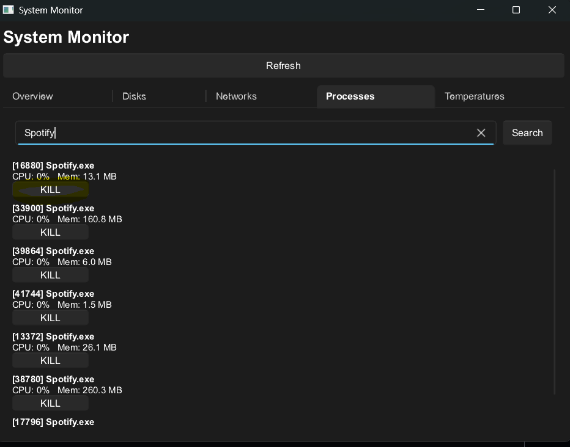

# Rust System Monitor
A lightweight rust system monitor, that runs on every os that supports _sysinfo_

## Usage
After data is collected the program starts the program window.
  
You can than change the tab to see the information you need, and also go to the _process_ tab and search a process:
  

### The 'refresh button'
To enable real time monitoring in a simple way I added a refresh button that allows you to constantly see the process and the usage of your components.

Now we see that CPU usage is at 5%:  
  
Than I press the refresh button and CPU usage is at 6%:  

### Kill processes
You can kill every process you want just by pressing the "kill" button under the proces name:  

# SECURITY UPDATE
The signing key of the .apk was leaked and because of that it has been changed, know any .apk file with the previus signing key is consideret unofficial.
- **DO NOT TRUST OR INSTALL ANYTHING THAT HAS THE OLD SIGNING KEY**
- **YOU MUST UNINSTALL THE OLD VERSION OF THE .apk FILE**