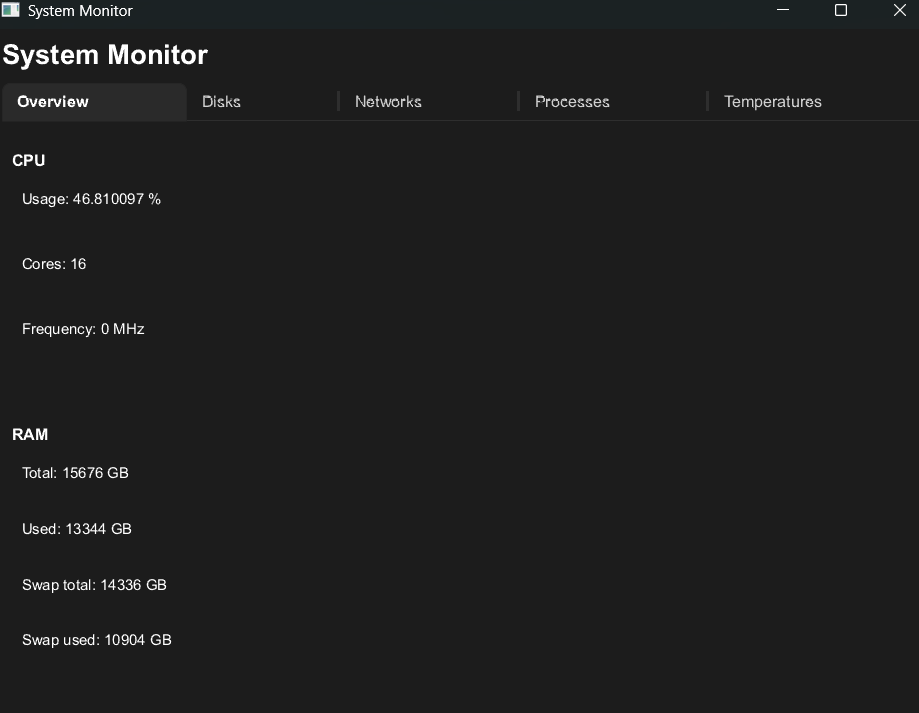
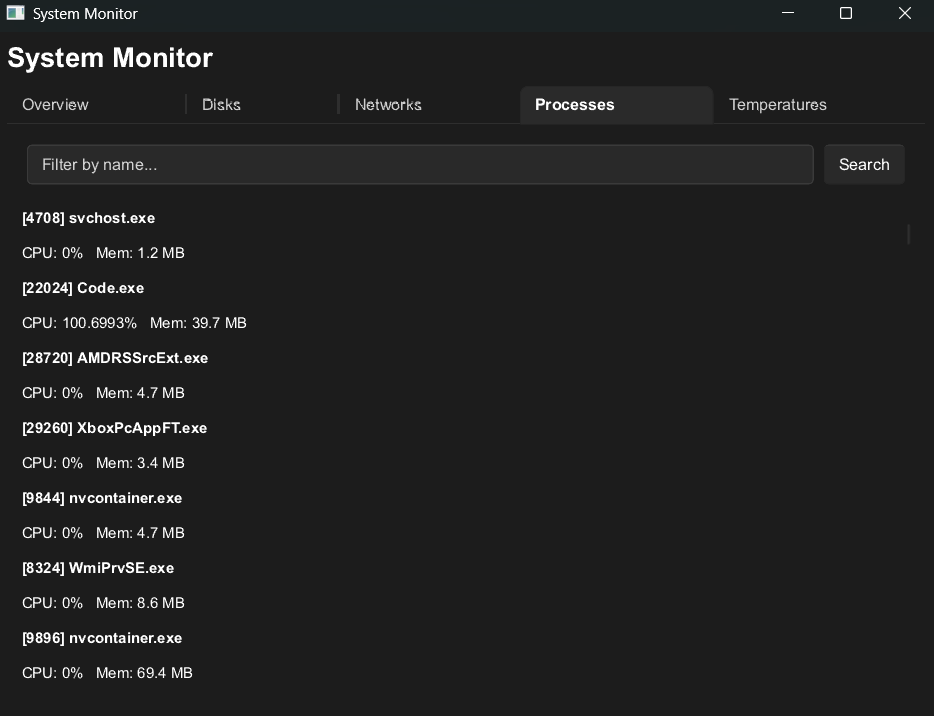
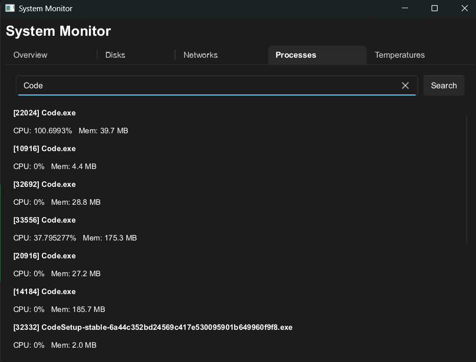
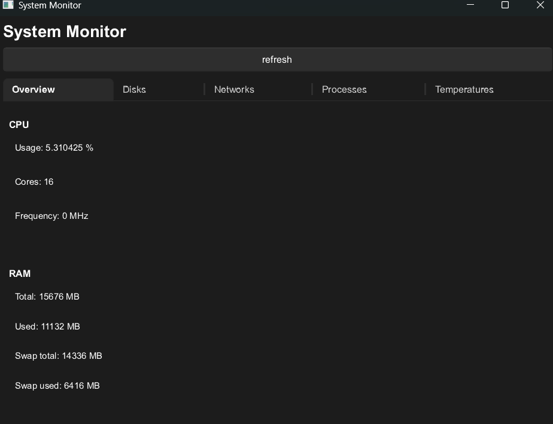
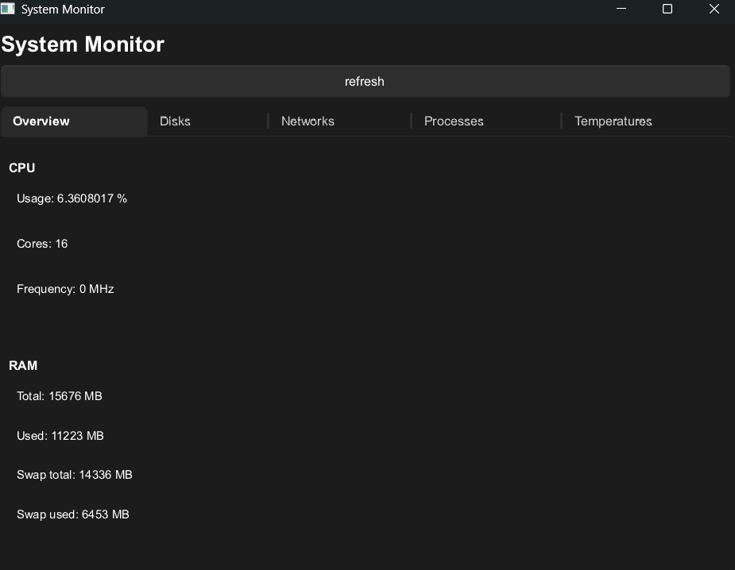

# Rust System Monitor
A lightweight rust system monitor, that allows you to search for a process by its name or list every process with a specific letter or keyword in it.

## how to use it
This allow you to run the program in "normal mode" and seeing every current info about the system.
```bash
cargo run
```
Now we are trying to find the process "firefox.exe" and find its infos, if firefox isn't executed, the programs panics.
```bash
cargo run -- -s firefox.exe
```
Now we are looking for every process with the word "fire" in it, if it doesn't found anything it returns an error.
```bash
cargo run -- -lf fire
```

## UI
After data is collected the program starts the program window.
  
You can than change the tab to see the information you need, and also go to the _process_ tab and search a process, like the _-lf_ option in CLI:  
  


### The 'refresh button'
To enable real time monitoring in a simple way I added a refresh button that allows you to constantly see the process and the usage of your components.

Now we see that CPU usage is at 5%:  
  
Than I press the refresh button and CPU usage is at 6%:  


# TO DO

- Adding real-time monitoring with no refresh button;
- Better data collecting of:  
    - CPU frequency;
    - CPU usage of processes;
    - Network data.